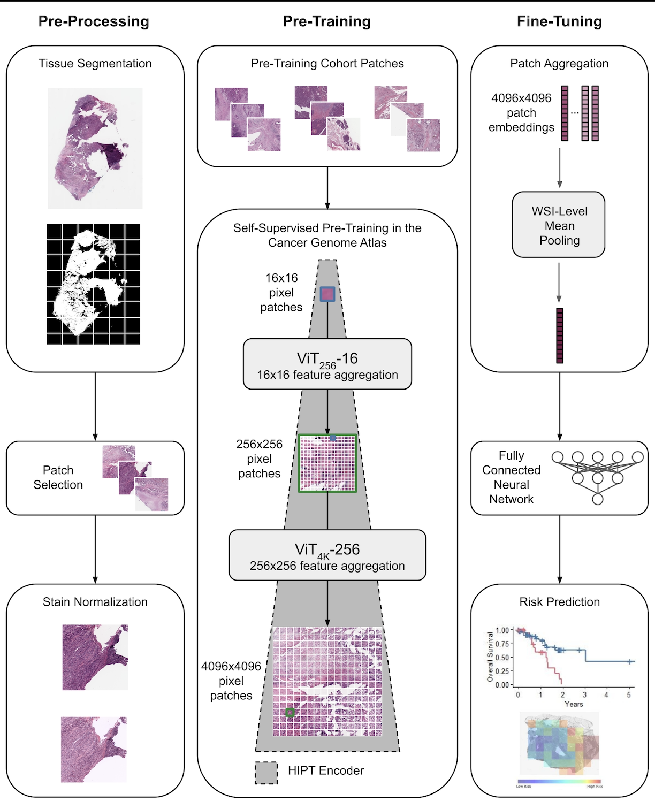

# PANACHE:  PANcreatobiliary cancer Artificial intelligence algorithm for Clinical and Histopathological Evaluation

PANACHE was developed to automatically assess cancer risk from digitized whole slide images (WSI) of resected pancreatic cancer. The aim of this model is to provide complementary information to traditional pathological grading, and inform clinical decision-making including adjuvant therapies and follow-up.

# Requirements

## Pretrained HIPT Models

To run the training or inference code, the pretrained HIPT models should be downloaded from https://github.com/mahmoodlab/HIPT/tree/master/HIPT_4K/Checkpoints and stored within the `./src/model/HIPT/pretrain_checkpoints` directory as `vit4k_xs_dino.pth` and `vit256_small_dino.pth`. 

**Note: A minimum of 1 GPU is required to run training and inference code.**

## Environment Setup

The required dependencies for running this project can be installed using conda and the provided `.yml` file. Run the following commands to set up the environment:
`conda env create -f ./histology.yml`
`conda activate histology`

## Data Preparation

- Data from TCGA can be downloaded directly using the following command:
  `# bash ./data/tcga/get_tcga.sh`
- Data from CPTAC can be downloaded from The Cancer Imaging Archive (https://www.cancerimagingarchive.net/collection/cptac-pda/). Whole-slide image files should be downloaded into the `./data/cia/images_raw` directory.
- Data from ICGC can no longer be downloaded from the data portal, but the patients included in this project are listed in `./data/icgc/icgc_clinical.csv`.

# Inference

To use the fine-tuned PANACHE model for inference, call the `run_inference.sh` script with the following input arguments:

`bash run_inference.sh <path to WSI directory> <magnification> <path to output jpg directory> <path to output dictionary directory> <path to output feature directory> <path to output csv file>`

The input WSI directory should contain only `.svs` files in the form `<slide id>.svs` and they should all be of the same magnification (either 20 or 40). In the process of generating predictions, 4096x4096 tiles will be saved as jpgs in the output jpg directory and their corresponding feature vectors will be saved in the output feature directory.
The inference code currently runs with up to 2 GPUs and the predictions will be saved in an output `.csv` file (format `<slide_id>,<prediction>`).

You can run the inference code on a single test WSI from the TCGA cohort using the following command:
`bash run_inference.sh ./data/tcga/images_raw 40 ./output/4k_jpgs ./output ./output/4k_ftrs ./output/predictions.csv`

# Training

The training code in this repository is designed to operate on public data from The Cancer Genome Atlas Program (TCGA), The National Cancer Institute's Clinical Proteomic Tumor Analysis Consortium (CPTAC), and the The International Cancer Genome Consortium (ICGC), but can be adapted for any additional dataset given the appropriate modifications in `./features/extract_features.py` to match the structure of the clinical files and specimen naming convention.

## Training Pipeline

After the datasets are downloaded, the entire training pipeline including WSI preprocessing and hyperparameter search can be run using the `run_train_pipeline.sh` script.

_Note_ based on the structure of your dataset, you may need to modify `./features/extract_features.py` to appropriately generate the dictionary files associated with each WSI.
